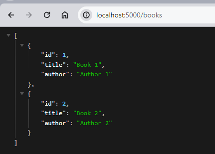
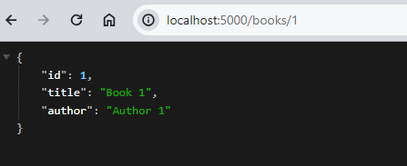

# Node.js Express CRUD Application

This is a simple Node.js Express CRUD books application.

## Prerequisites

Before running this application, make sure you have the following installed:

- Node.js > (version 16.3.0)
- npm > (version 7.15.1)

## Installation

1. Clone the repository:

    ```bash
    git clone https://github.com/moamahfouz/nodejs-express-crud.git
    ```

2. Navigate to the project directory:

    ```bash
    cd nodejs-express-crud
    ```

3. Install the dependencies:

    ```bash
    npm install
    ```

## Screenshots

### Get all books



### Get book by id

